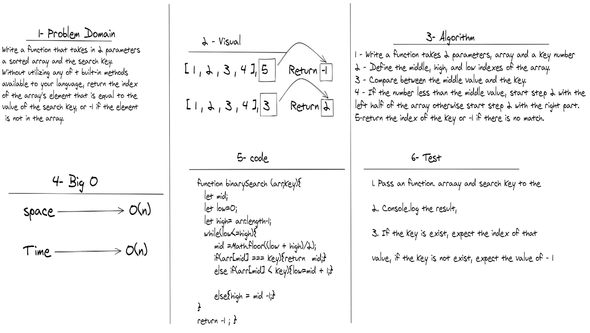
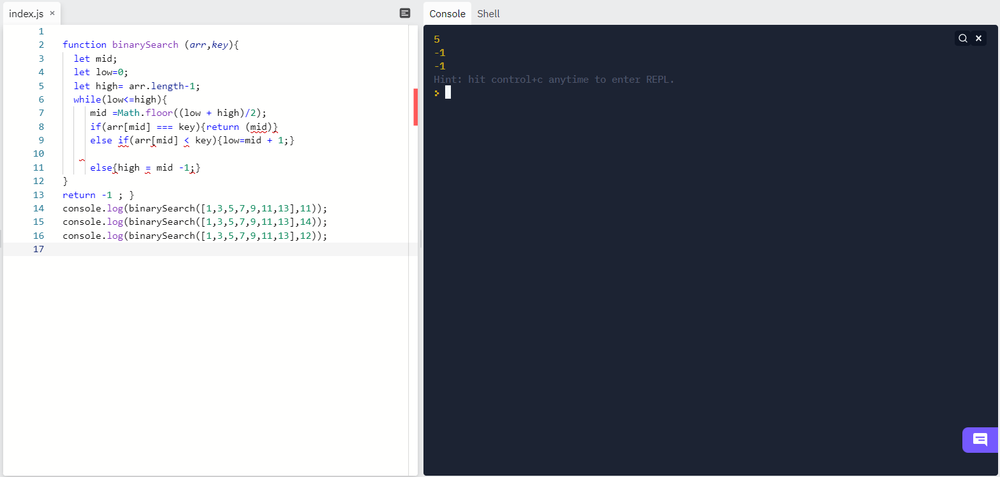

# Binary Search of Sorted Array
<!-- Description of the challenge -->
Write a function that takes in 2 parameters: a sorted array and the search key. Without utilizing any of the built-in methods available to your language, return the index of the array's element that is equal to the value of the search key, or -1 if the element is not in the array.
## Whiteboard Process
<!-- Embedded whiteboard image -->

## Approach & Efficiency

* creating a function, containing while loop, and search in the array, about a number if its exist.

* the assignment took  1 hour.
* [Back<<](../README.md)
