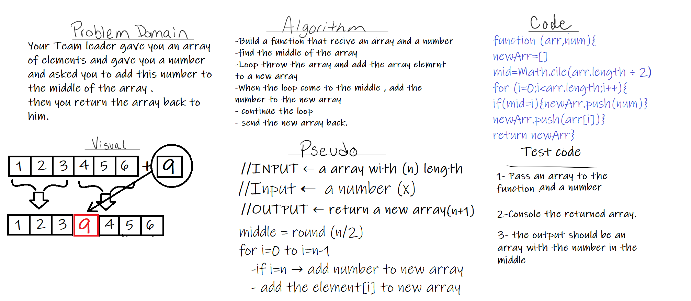
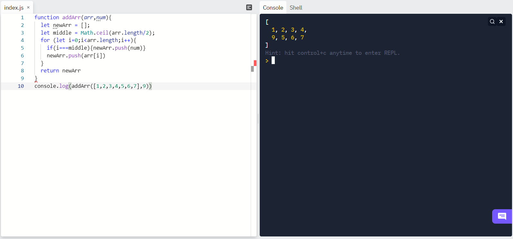

# Insert to Middle of an Array
<!-- Description of the challenge -->
To find the best way to add a number to the middle of an array and return the value to be used

## Whiteboard Process
<!-- Embedded whiteboard image -->

## Approach & Efficiency

* creating a function, containing for loop, receive an array and a number ,find the middle of the array push the elements from old array to new array and push the number when the loop come to the middle
  

* the assignment took  1 hour.
* [Back<<](../README.md)
