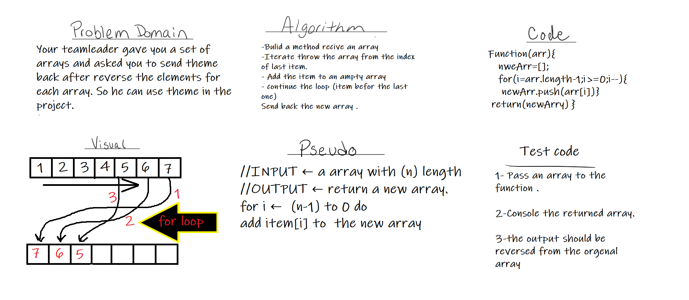
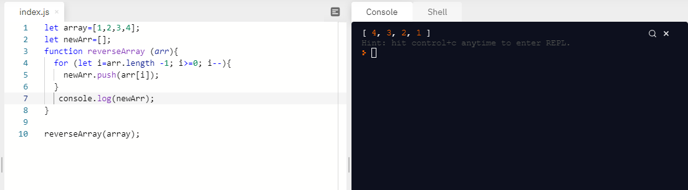

# Reverse an Array
<!-- Description of the challenge -->
To find the best way revers the order of the elements in an array and return the value to be used

## Whiteboard Process
<!-- Embedded whiteboard image -->

## Approach & Efficiency

* creating a function, containing for loop, receive an array and push the elements from last element to the first index of new array
  
* the assignment took  1 hour.

* [Back<<](../README.md)
