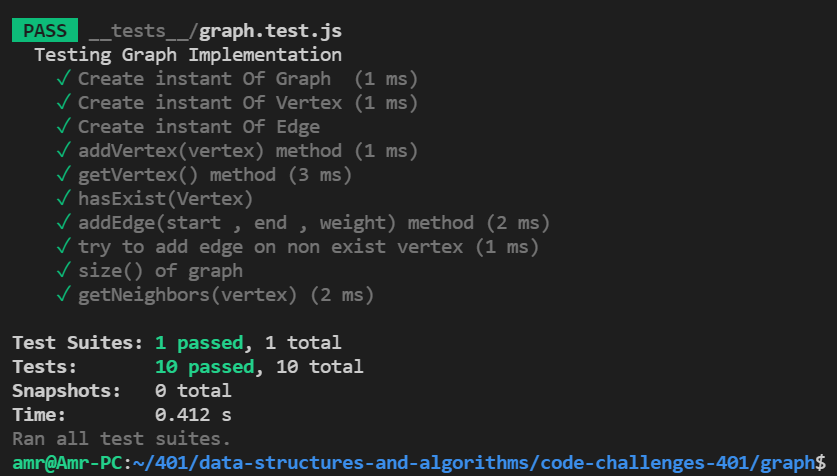

# Graphs
* A non-linear data structure that can be looked at as a collection of vertices (or nodes) potentially connected by line segments named edges.
*  it's a non liner DS , consist of vertex hold the values and these vertex maybe connected to each other by edges , in some type of  Graph called weight graph these edge hold weight
* graph  common to be directional or unidirectional
    * directional : if the edge has arrow pointer of the specific direction
    * unidirectional : mean we can pass in bidirectional

## Challenge
* Implement your own Graph. The graph should be represented as an adjacency list, and should include the following methods:
    * add node/vertex
    * add edge
    * get nodes
    * get neighbors
    * size

## Approach & Efficiency
* adjacency list faster in lookup up & easy to find neighbor

## API
* *add node*
    * Arguments: value
    * Returns: The added node
    * Add a node to the graph

* *add edge*
    * Arguments: 2 nodes to be connected by the edge, weight (optional)
    * Returns: nothing
    * Adds a new edge between two nodes in the graph
    * If specified, assign a weight to the edge
    * Both nodes should already be in the Graph

* *get nodes*
    * Arguments: none
    * Returns all of the nodes in the graph as a collection (set, list, or similar)

* *get neighbors*
    * Arguments: node
    * Returns a collection of edges connected to the given node
    * Include the weight of the connection in the returned collection
    
* *size*
    * Arguments: none
    * Returns the total number of nodes in the graph.

    *** 
    ## Testing 
    