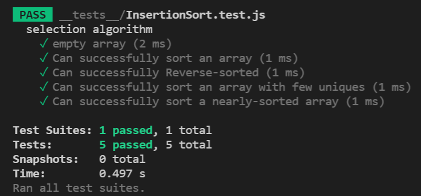

## Code Challenge: Insertion Sort

#### Introduction

**Insertion Sort is a sorting algorithm that traverses the array. For each passthrough, the current value at index i is repeatedly compared to the value at the previous index and swapped until the previous value is smaller than the current value. The array is sorted in place.**

[Pull Request](https://github.com/amr88nzzal/data-structures-and-algorithms/pull/27)