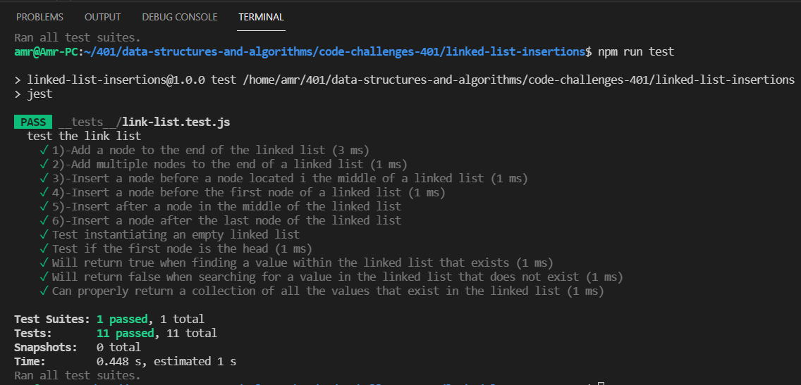

# Challenge Summary

* **The class should contain the following methods**

- [x] append
arguments: new value
adds a new node with the given value to the end of the list
- [x] insert before
arguments: value, new value
adds a new node with the given new value immediately before the first node that has the value specified   
- [x] insert after
arguments: value, new value
adds a new node with the given new value immediately after the first node that has the value specified   

## **testing** 

- [x] Can successfully add a node to the end of the linked list  
- [x] Can successfully add multiple nodes to the end of a linked list  
- [x] Can successfully insert a node before a node located i the middle of a linked list  
- [x] Can successfully insert a node before the first node of a linked list  
- [x] Can successfully insert after a node in the middle of the linked list  
- [x] Can successfully insert a node after the last node of the linked list  
  
## Whiteboard Process
<!-- Embedded whiteboard image -->

## Approach & Efficiency
<!-- What approach did you take? Why? What is the Big O space/time for this approach? -->
find a solution pass the test
## Solution
<!-- Show how to run your code, and examples of it in action -->
run `npm test` to show the result

****