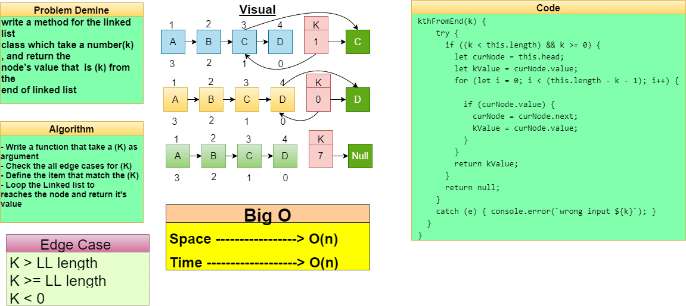
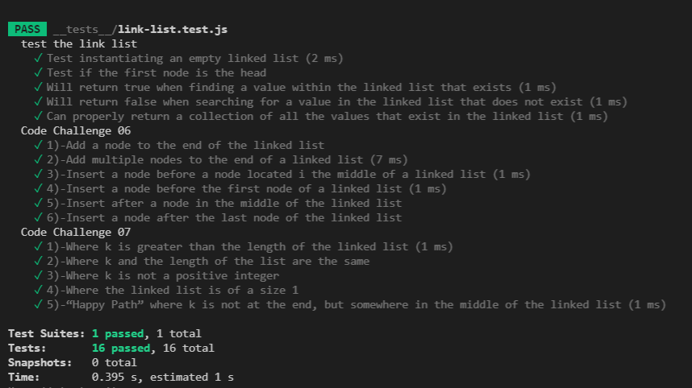

# Challenge Summary
<!-- Description of the challenge -->
## **kthFromEnd method: which takes a number (k) as parameter and return the node’s value that is k from the end of the linked list.within the list.**

## Whiteboard Process
<!-- Embedded whiteboard image -->

## Approach & Efficiency
<!-- What approach did you take? Why? What is the Big O space/time for this approach? -->
- [x] Where k is greater than the length of the linked list
- [x] Where k and the length of the list are the same
- [x] Where k is not a positive integer
- [x] Where the linked list is of a size 1
- [x] “Happy Path” where k is not at the end, but somewhere in the middle of the linked list
