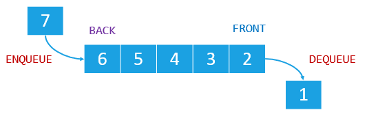
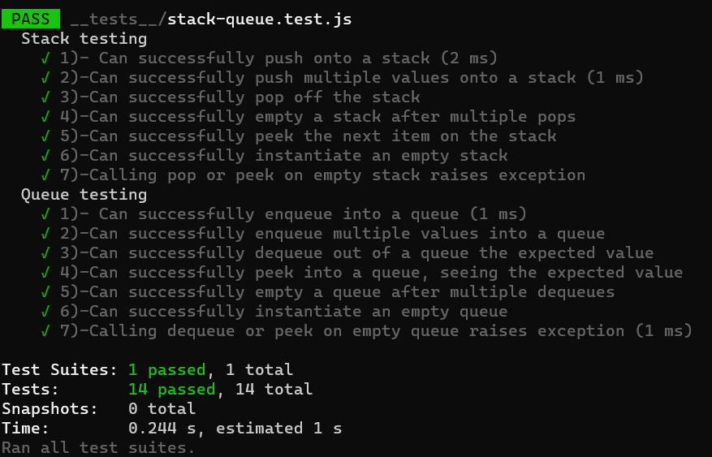
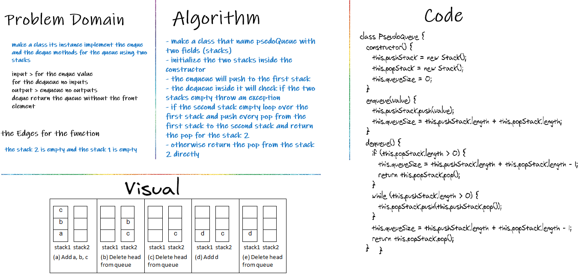
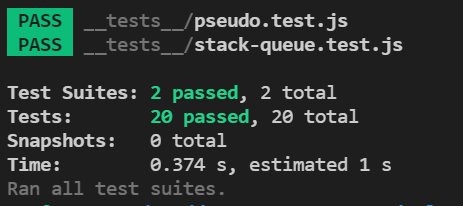

# Stacks and Queues
<!-- Short summary or background information -->

- **Stack**: is a data structure that consists of Nodes. Each Node references the next Node in the stack, but does not reference its previous.

- **Queue**: It is a linear structure which follows a particular order in which the operations are performed. The order is First In First Out (FIFO).

---

## Challenge

**Stack**:

Create a Stack class that has a top property, and push, pop, peek, and is empty methods:

1. `push`: adds a new node with that value to the top of the stack with an O(1) Time performance.
2. `pop`: Removes the node from the top of the stack.
3. `peek`: Returns the Value of the node located at the top of the stack.
4. `isEmpty`: Returns boolean indicating whether or not the stack is empty.

**Queue**:

Create a Queue class that has a front property, and enqueue, dequeue, peek, and is empty methods:

1. `enqueue`: adds a new node with that value to the back of the queue with an O(1) Time performance.
2. `dequeue`: Removes the node from the front of the queue.
3. `peek`: Returns the Value of the node located at the front of the queue
4. `isEmpty`: Returns boolean indicating whether or not the queue is empty.

---
## Approach & Efficiency

- Space : O(1)
- Time : O(1)

---
## testing

---
# Queues with Stacks 

* Implement a queue using two stacks. 

## Challenge

* Implement a queue by using two instance of a Stack class.
* One of them is used for enqueue and the second one is for dequeue.
* Create a new `PseudoQueue` class, which will implement standard queue interface (two methods listed below), but will internally only utilize 2 stack objects.
* `enqueue(value)` which inserts value into the PseudoQueue using a first-in,first-out approach.
* `dequeue()` which extracts a value from the PseudoQueue using a first-in,first-out approach.
* Stack instances have only push, pop, and peek methods.

## Approach & Efficiency

* Enqueue: space O(1) -> time O(1).
* Dequeue: space O(n) -> time O(n).

## White Board :

## Test :

