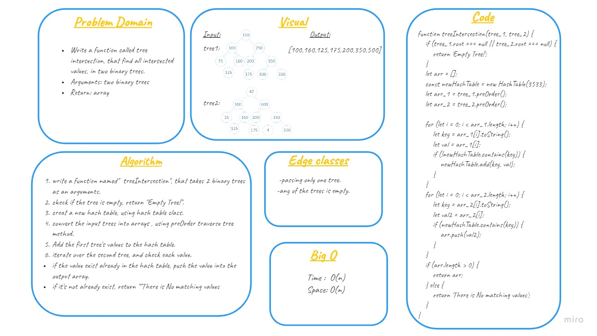
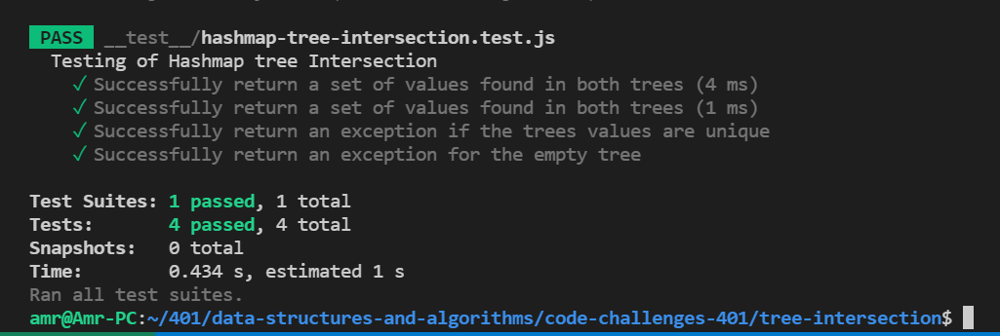

# Hashmap Tree Intersection

## create a method called treeIntersection that is Finds the common values in 2 binary trees and return an array.

## Approach

- ### understood the problem
- ### made a drawings of how the hashTable would be after insertion of multiple key and values.
- ### wrote the code
- ### made the tests

## whiteboard 
 

 ## Testing 
 