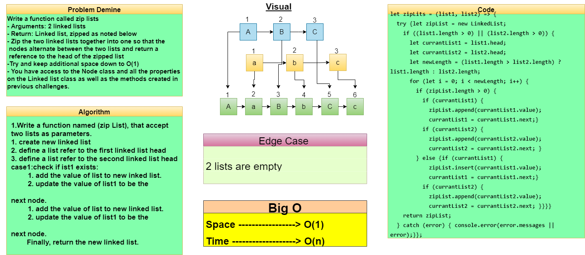
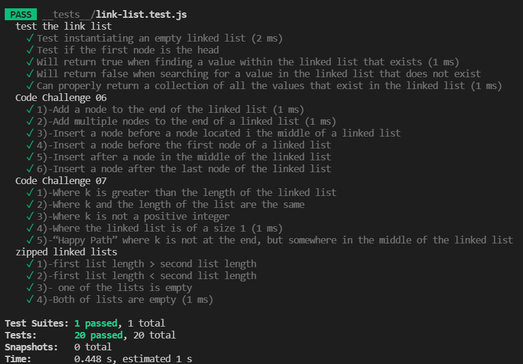

# Challenge Summary
<!-- Description of the challenge -->
## **write a function that takes two linked list as arguments and return a new linked list that is combined between the passed linked lists with a unique order for it**

## Whiteboard Process
<!-- Embedded whiteboard image -->

## Approach & Efficiency
<!-- What approach did you take? Why? What is the Big O space/time for this approach? -->
- [x] First list length > second list length
- [x] First list length < second list length
- [x] One of the lists is empty
- [x] Both of lists are empty

